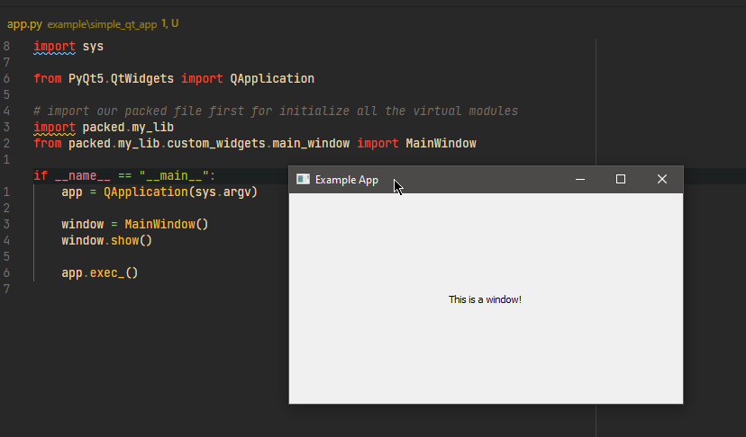
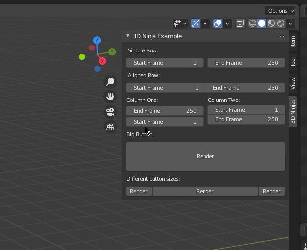

## Qt app



_A small qt app to demonstrate the usage of Pyscriptpacker_

---

Here is a simple qt app, using Pyscriptpacker to pack a custom [:octicons-file-code-24: widget library](https://github.com/3dninjas/pyscriptpacker) (`my_lib`) and then use it as a separate module for other projects.  

Packer command line:

``` console
$ pyscriptpacker -c all custom_widgets ./unpacked ./packed/my_lib.py
```

??? note
    The `-c` flag is used for compression, see [here](/features/#compressing) for more information.

Looking at the command line use for packing, we provided these information to the Pyscriptpacker:

- The module name we want to pack. (`custom_widgets`)
- The path to that module. (`./unpacked`)
- The output file and where it should be. (`./packed/my_lib.py`)

**Pyscriptpacker** will go through all the files in the module and add the source codes into the _**virtual_module**_ variable, then use the custom loader whenever we call to the packed file.

!!! important
    Please note that we need to import the packed file first before actually calling any modules in it. 

    ``` python
    # import our packed file first for initialize our virtual bundle
    import packed.my_lib
    from packed.my_lib.custom_widgets.main_window import MainWindow
    ```

## Blender addon



_Blender addon using Pyscriptpacker for packing into a zip file_

---

Here is a simple example, using Pyscriptpacker to pack this blender [:octicons-file-code-24: example addon](https://github.com/3dninjas/pyscriptpacker). 

Packer command line:

``` console
$ pyscriptpacker -z packed/addon.zip -m ./unpacked/__init__.py addon ./unpacked ./example_addon/__init__.py
```

This example is quite similar to the qt example app except:

- In this example, we use a flag `-m main_file, --main=main_file` which helps the user to determine the main script which need to be executed when import that module, also a requirement for addon to be regconized by Blender (*bl_info* in `__init__.py`).
- Furthermore, we use [`-z zip_file, --zip=zip_file`](/features/#zipping-output) for zipping our output example addon into a zip file, so we can just take that zip file and release the addon.

!!! warning
    The `-c, --compress` does not work well when you are trying to deliver a Blender addon due to Blender has to parse the file and look for `bl_info` before actually import the addon.
